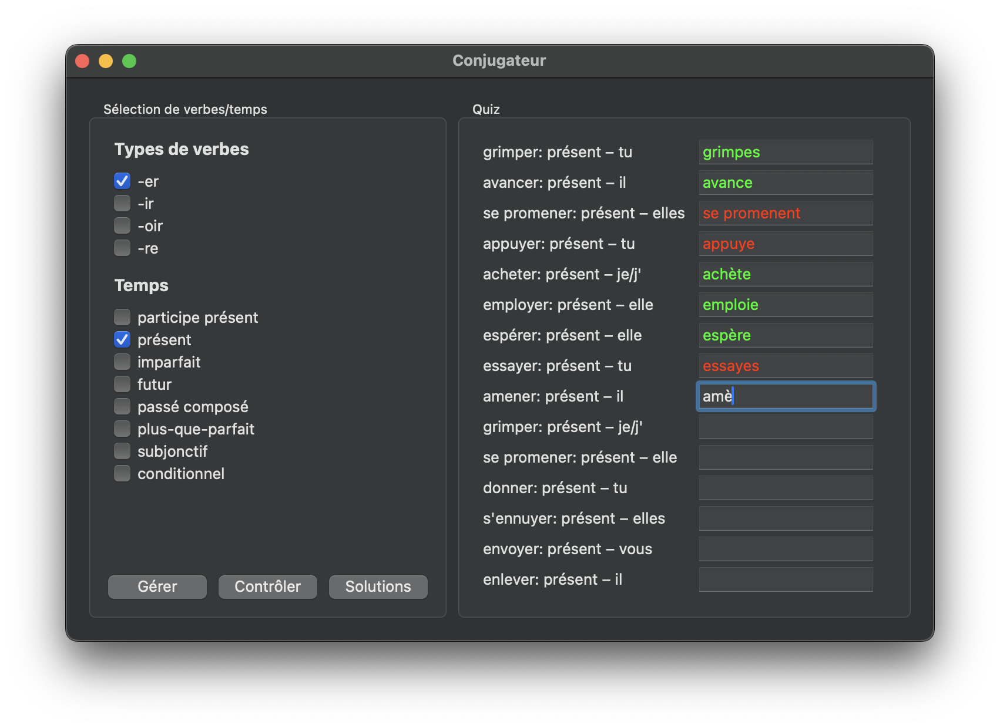
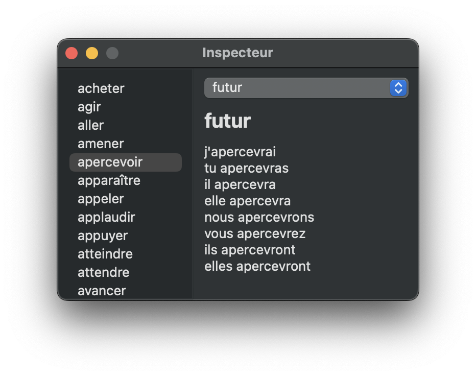

# Conjugateur

This application was designed to help students study french verbs. Version 1.0.0 is currently at the end of its development stage and a dowload of the beta version can be found in the [releases of the GitHub repo](https://github.com/tifrueh/conjugateur/releases). 

## Installation

### macOS (homebrew)

A precompiled version and packaged version for macOS can be downloaded and installed via my homebrew repository:

1. Tap my homebrew tap

~~~
$ brew tap tifrueh/mytap
~~~

2. Install Conjugateur

~~~
$ brew install --cask tifrueh/mytap/conjugateur
~~~

### macOS (manual install)

If you don't have homebrew you can also use the installer package for macOS from the [latest release](https://github.com/tifrueh/conjugateur/releases/latest).

1. Download the installer package

2. Double-click the PKG

3. Follow the installer's instructions

### Windows

An installer executable for x86_64 Windows can be downloaded from the [latest release](https://github.com/tifrueh/conjugateur/releases/latest).

1. Download the installer executable

2. Double click the EXE

3. Follow the installer's instructions

_Note: As the EXE is not signed, Windows is probably going to warn you about installing untrusted software and it is absolutely right. I'm going to fix this issue in the future, but for the moment, this admittedly insecure installation procedure will have to do._

### Build from source

If your system is neither macOS nor x86_64 Windows, you'll have to compile and install the program yourself. Additional sofware components you'll need for that are the following:

- [meson build system](https://mesonbuild.com/)

- [wxwidgets](https://www.wxwidgets.org/)

## Preview (macOS)

## Usage

There are two distinct sections in the application's GUI:

1. [**Sélection des verbes/temps**](#sélection-des-verbestemps)

2. [**Quiz**](#quiz)

### Sélection des verbes/temps

This panel is used to control the **Quiz** section of the app. Firstly, under the header **Types de verbes** you can select which kinds of verbs will be used in the quiz and under the header **Temps** you can select the tenses which will be used in the quiz.

The button **Gérer** generates a new quiz.

The button **Contrôler** checks the correctness of the answers in the quiz and marks them in different colours.

The button **Solutions** checks the verbs and also shows the correct solutions.

### Quiz

This panel displays a total of 15 text entries plus the infitinive, a tense and a personal pronoun. You can now try to put the correct verb form into the text entry and then use the buttons to the bottom left (see [previous section](#sélection-des-verbestemps)) to check your answers or show the solutions.

### Keyboard shortcuts

`Ctrl+1`: Select all verbs

`Ctrl+2`: Select all tenses

`Ctrl+0`: Unselect all verbs and tenses

`Ctrl+Enter`: Generate new quiz

`Ctrl+Shift+Enter`: Check answers

`Ctrl+S`: Show solutions

`Ctrl+I`: Open **Inspecteur**

_Note: `Ctrl` corresponds to `Cmd` on macOS systems_

### Inspector

There is also an additional window, called **Inspecteur**, which can be used to display the whole conjugation of a verb. This window is primarily intended to be used by poofreaders who, by using the **Inspecteur**, can view the entirety of the database used by the app and therefore find mistakes (of which I'm sure there are plenty) faster than by simply using the app. The **Inspecteur** can of course also be used to help out while learning the conjugations.

_Note to proofreaders: If you were to find any misspelled forms via the **Inspecteur** or otherwhise, please do not hesitate to open an [issue](https://github.com/tifrueh/conjugateur/issues) to let me know. I'll try to fix it as soon as possible._
